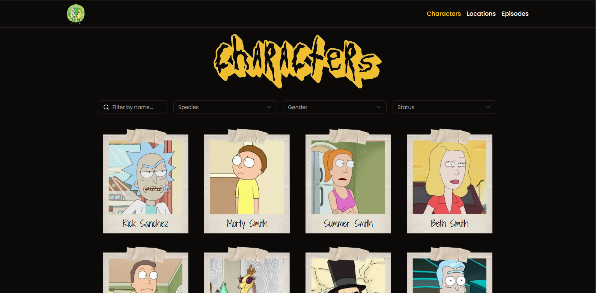

# Rick And Morty Project



## Descrição

O Rick and Morty Project é um projeto de front-end que consome uma API para listar informações sobre os personagens, episódios e planetas da famosa série de TV "Rick and Morty". Este projeto foi desenvolvido com **Nextjs**, **Typescript**, **Tailwind CSS** e **shadcn/ui** para criar uma experiência de usuário interativa e dinâmica.

[Link do Site](https://rick-and-morty-project-3.vercel.app)


## Funcionalidades

- **Personagens:** Visualize uma lista completa de todos os personagens da série, incluindo detalhes como nome, gênero, status, espécie, origem, tipo e localização.

- **Episódios:** Obtenha informações detalhadas sobre os episódios, incluindo título, data de lançamento e elenco.

- **Locais:** Obtenha informações sobre os locais que aparecem na série, incluindo nome, residentes e dimensão.

## Como Executar

1. Clone este repositório em sua máquina local.
2. Instale as dependências usando o comando:
   ```
   npm install
   ```
3. Inicie o aplicativo com:
   ```
   npm run dev
   ```
4. Abra o aplicativo no seu navegador.